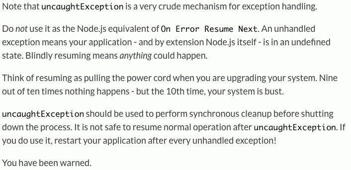
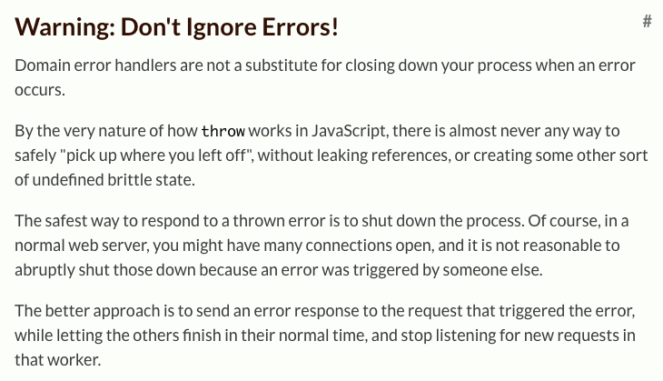

## 東京Node学園祭2015
# .m80-t.center[.fs-ml[Node.jsでのゲームサーバ開発]<br>.fs-ll[愛すべきバッドノウハウ3選]]
## .m80-t.right[株式会社サイバーエージェント<br>.fs-m[森 久太郎]<br>Twitter/Github/はてなブログ: @qsona]
???
hollow
---
# 自己紹介
.list-l[
- Node.jsでゲームのサーバ開発中
- Node.js歴=職業プログラマ歴=2年半
]
.list-m[
- 将棋, 対戦ゲーム, 音楽ゲームが好き
- 息子 3歳半 / 娘 10ヶ月
]

---
# はじめに

.fs-m[
「フツウ」の<br>
サーバサイド開発に<br>
Node.jsを採用しませんか？
]

- 例えば、PHP~~を避ける~~の代わりにNode.js

---
# 「フツウに良い」Node.js
.col-4.list-s[
- 速い
- 楽しい
- 導入が楽
- 単体でサーバ立つ
]
.col-4.list-s[
- npmになんでもある
- フロントと同じ言語
- 開発盛ん
- etc
]

「一旦Nodeでいいじゃん」の流れをつくりたい]

.center[国内の採用事例はまだまだ少ない]

---
# 先月の仮説

.fs-m[学習コストが高いのでは？]

- 東京Node学園18時限目 LT<br>
「チーム開発においてNode未経験者の学習コストを下げる工夫」<br>
<cite>http://qsona.hatenablog.com/entry/2015/10/13/090847</cite>

---
# 今日の仮説
.fs-l[Node.js、サーバサイド開発に<br>向いてないのでは？]

---
# 今日の仮説
(元も子もないようだが)割と一般的な意見
https://twitter.com/teppeis/status/545940492219727873
http://mizchi.hatenablog.com/entry/2014/10/08/003228

---
# 個人的な見解
- 難しい面は実際にあると思う
- それを補って余りある魅力もある
- 普段の開発で、辛さを感じることはない
  - 感じていないだけかもしれない

---
# バッドノウハウとは？
> (前略)何でこんなことを覚えないといけないのだろうか、とストレスを感じつつも、(中略)しぶしぶ覚えなければならない(中略)そうした雑多なノウハウのことを、 本来は知りたくもないノウハウという意味で、私はバッドノウハウと呼んでいる。
> <cite>http://0xcc.net/misc/bad-knowhow.html</cite>

ここでは
- あまり覚えたくないノウハウ
- 本来やりたくない(けど仕方ない)手法

---
# 本セッションのコンテキスト
- ゲームのAPIサーバ開発に限って論じる
  - 特にソーシャルゲームを想定
  - サーバ開発一般に通じる話が多いはず

- ECMAScript5 までに限定する

---
# 本題の前に
.fs-m[ゲームサーバ開発の特徴を挙げる]

---
# ゲームサーバの特徴
- 定型的なAPIが少ない
  - 単なるCRUDがほぼない
  - RESTfulとか無理
- ユーザに強く結びついている
  - 「誰に対しても同じデータを返す」ようなAPIがめったにない
- マスターデータの存在

---
# マスターデータとは
.fs-m[ゲームそのものに関してのデータ]
- クエスト、イベント、敵、マップ、などなど
- 運営側が用意するもの
- 個々のユーザとは紐付かない

---
# .fs-m[マスターデータにまつわる話]

- 入力支援 (管理画面、スプレッドシート等)
  - 入力はエンジニア以外が行うことが多い
  - 入力をやりやすくするのはとっても重要
- 管理 (バックアップ、タグ付けなど)
- データが正しいかの検証
- 利用 (アプリ上での持ち方など)

---
# .fs-m[マスターデータにまつわる話 (2)]

.fs-m[ゲーム開発は、マスターデータ無しには語れない]

.fs-s[
例: Final Fantasy Record Keeperのマスターデータを支える技術 (DeNA 渋川さん)<br>
<cite>http://www.slideshare.net/dena_study/final-fantasy-record-keeper</cite>
]

.fs-m[今回は、Node.jsサーバアプリ上での<br>利用の話をする]

---
# マスターデータの利用
Nodeアプリ起動時にDBから読み込み、<br>整形してプロセス上のオブジェクトとして乗せる
.list-s[
- 通常の量なら十分乗る
- IDをキーにする
  - 99%くらい(?)はIDで引く
]

ex) Quest マスタ
```javascript
{ 'quest01': { quest_id: 'quest01', map_id: 'map01', tasks: [ ... ] },
  'quest02': { quest_id: 'quest02', map_id: 'map02', tasks: [ ... ] } }
```

---

# 有利な点
- データストアとして最速
- 非同期呼び出しにならない
- (起動時に)好きなように変形して持てる
  - 使いやすいように、冗長に持つ
  - リレーション => 実体を直接参照

---
# 注意点と対策

注意点:
.list-s[
- DBと違い、index がない
  - 大量にデータが有り、ID以外で引く場合に問題になる
]

対策:
.list-s[
- 起動時にソートし、別に保持
  - indexの代わり
- クエリが固定なら、起動時に検索を行いそれを保持
]

---
# 注意点と対策 (2)

注意点:
.list-s[
- 誤って書き換えてしまう可能性がある
  - ただのJavaScript上のオブジェクトなので。。
  - やらかして障害にした経験あり
]

対策:
.list-s[
- 起動時にObject.freezeを再帰的に行う
- `'use strict'`
  - 変更しようとした瞬間にTypeError
]

---
class: center, middle
# .fs-l[ここまでグッドノウハウ]

---
class: center, middle
# .fs-l[ここからバッドノウハウ]

---
class: center, middle
## .fs-m[BAD No.1]
# .fs-l[非同期フロー制御に関する戦い<br>]
## .fs-m[〜neo-async.angelFallに至るまで〜]

---
# .fs-m[非同期フロー制御に関する戦い]
## 〜neo-async.angelFallに至るまで〜
.kakuzuke.m80-t[
|unused--|unused|
|--------|------|
|Bad度   |★★★☆☆ |
|Node度  |★★★★★ |
|ゲーム度|★★☆☆☆ |
|かたさ  |ふつう|
]

---
# 概要

.fs-m[
非同期フロー制御に関する戦いと<br>
それにより得られたノウハウ
]

注: 今から7分間、とてもニッチな話をします

---
# Node.jsの規約

callback スタイル

- 非同期関数の最後の引数にcallback
- callbackの第1引数はError Object<br>(エラーでなければnull or undefined)

---
# 同期コード例
.code-l[
```javascript
function sample_sync(param) {
  var num = getNumberSync(param);
  var text = generateTextSync(num);
  checkNgWordSync(text2);
  return { num: num, text: test };
}
```
]
.fs-s[※注: checkNgWordSync は、NGならエラーを投げる]

このコードが、非同期呼び出しになるとどうなるか<br>見ていく
---
.code-title[非同期コード例(plain)]
.code-m[
```javascript
function sample_plain(param, callback) {
  getNumber(function(err, num) {
    if (err) {
      return callback(err);
    }
    generateText(num, function(err, text) {
      if (err) {
        return callback(err);
      }
      checkNgWord(text, function(err) {
        if (err) {
          return callback(err);
        }
        callback(null, { num: num, text: text });
      });
    });
  });
};
```
]

---
# 非同期コード(plain)の問題点
- if (err) 句が無駄に多い
- ネストが深くなる

.fs-ss[※注: checkNgWordSync は、NGならcallbackにエラーを返し、<br>OKなら何も引数なしでcallbackを呼ぶ]

---
# 非同期フロー制御

非同期フローを制御するモジュールにより、<br>問題を解決する

弊社では async (Github: caolan/async) を利用してきた

---
# asyncについて

直列な非同期コードを書き換える方法がいくつか存在

.list-s[
- async.waterfall
- async.series
- async.auto (直列/並列を自動で)
]

弊社では長らくasync.seriesが主流だった

---
※ 次から出るコードの注意点
.list-s[
- `var async = require('async');`は省略
- 定義されていない関数は、非同期メソッドとして定義されているものとする
]

次頁: .code-title[async.series コード例]
---

```javascript
function sample_series(param, callback) {
  var num, text;
  async.series([
    function(next) {
      getNumber(param, function(err, _num) {
        if (err) {
          return next(err);
        }
        num = _num;
        next();
      });
    },
    function(next) {
      generateText(num, function(err, _text) {
        if (err) {
          return next(err);
        }
        text = _text;
        next();
      });
    },
    function(next) {
      checkNgWord(text, next);
    }
  ], function(err) {
    if (err) {
      return callback(err);
    }
    callback(null, { num: num, text: text });
  });
}
```

---
```javascript
function sample_plain(param, callback) {
  getNumber(function(err, num) {
    if (err) {
      return callback(err);
    }
    generateText(num, function(err, text) {
      if (err) {
        return callback(err);
      }
      checkNgWord(text, function(err) {
        if (err) {
          return callback(err);
        }
        callback(null, { num: num, text: text });
      });
    });
  });
};
```
※ 非同期コード例(plain) 比較用に再掲
---
# async.seriesの問題点
- `if (err)` が減ってない
- ネストは減ったが、コード量が増えすぎ

というわけで、<br>
async.waterfallにしてみた

結果: `if (err)` がなくなり、コードが短くなった

---
.code-title[async.waterfall コード例]
.code-m[
```javascript
function sample_waterfall(param, callback) {
  var num, text;
  async.waterfall([
    function(next) {
      getNumber(param, next);
    },
    function(_num, next) {
      num = _num;
      generateText(num, next);
    },
    function(_text, next) {
      text = _text;
      checkNgWord(text, next);
    },
    function(next) {
      next(null, { num: num, text: text });
    }
  ], callback);
}
```
]


---
.code-title[async.waterfall の動作解説用]
.code-m[
```javascript
function sample_waterfall1(param, callback) {
  var num, text;
  async.waterfall([
    function(next) {
      next(null, 1);
    },
    function(_num, next) {
      num = _num;
      next(null, 'text');
    },
    function(_text, next) {
      text = _text;
      next();
    },
    function(next) {
      next(null, { num: num, text: text });
    }
  ], callback);
}
```
]

---
# async.waterfallの問題点

.fs-m[next に渡される引数の個数に応じて、<br>次の関数に入る引数の個数が変わる]

↓

.fs-m[ある関数が、コールバックに渡す<br>引数の個数を増やすことが<br> Breaking Changeに繋がる]

---
.code-title[コード例(OK)]
```
function checkNgWord(text, callback) {
* callback();
}

function sample_waterfall(param, callback) {
  var num, text;
  async.waterfall([
    function(next) {
      getNumber(param, next);
    },
    function(_num, next) {
      num = _num;
      generateText(num, next);
    },
    function(_text, next) {
      text = _text;
      checkNgWord(text, next);
    },
*   function(next) {
      next(null, { num: num, text: text });
    }
  ], callback);
}
```

---
.code-title[コード例(動かない)]
```
function checkNgWord(text, callback) {
* callback(null, { /* detail */ });
}

function sample_waterfall(param, callback) {
  var num, text;
  async.waterfall([
    function(next) {
      getNumber(param, next);
    },
    function(_num, next) {
      num = _num;
      generateText(num, next);
    },
    function(_text, next) {
      text = _text;
      checkNgWord(text, next);
    },
*   function(next) {
      next(null, { num: num, text: text });
    }
  ], callback);
}
```
.fs-s[`checkNgWord`の修正により、`sample_waterfall`が動かなくなっている]

---
.code-title[コード例(修正後)]
```
function checkNgWord(text, callback) {
* callback(null, { /* detail */ });
}

function sample_waterfall(param, callback) {
  var num, text;
  async.waterfall([
    function(next) {
      getNumber(param, next);
    },
    function(_num, next) {
      num = _num;
      generateText(num, next);
    },
    function(_text, next) {
      text = _text;
      checkNgWord(text, next);
    },
*   function(unused, next) {
      next(null, { num: num, text: text });
    }
  ], callback);
}
```
---
# neo-async

- Github: suguru03/neo-async
- asyncのクローン
- 機能を増やし、速度を向上させている
- 元弊社エンジニア @suguru03 が<br>フルスクラッチで作成
  - 退職して語学留学へ、本日カナダに飛ぶようです

---
# neo-async.angelFall

- async.waterfallと基本的には同じ
- next に渡される引数の個数が変わっても、<br>次の関数に入る引数の個数が変わらない

次頁: .code-title[コード例(元: 動かない => 現: 動く)]

.fs-s[※async.waterfallをneo-async.angelFallに変えると<br>動かないサンプルが動くようになる]
---
```
*var async = require('neo-async');

function checkNgWord(text, callback) {
* callback(null, { /* detail */ });
}

function sample_angelFall(param, callback) {
  var num, text;
* async.angelFall([
    function(next) {
      getNumber(param, next);
    },
    function(_num, next) {
      num = _num;
      generateText(num, next);
    },
    function(_text, next) {
      text = _text;
      checkNgWord(text, next);
    },
*   function(next) {
      next(null, { num: num, text: text });
    }
  ], callback);
}
```
---
# 技術的背景
Function.length を利用している
- 定義された仮引数の個数が取れる
- 次の関数が受ける、引数の個数を見ている

やや黒魔術に近い<br>
★★ BAD ★★

---
# .fs-m[async.waterfall の問題点 (2)]

- 関数の区切りが意味の区切りにならないことがある
  - フローにif文が入ると辛い

- neo-async.angelFall も同じ

---
# 同期コード例
.code-l[
```javascript
function sample_sync(param) {
  var x = getX(param);
  if (x) {
    var y = getY();
    var z = getZ();
    doSomething(y, z);
  }
  return getW(x);
}
```
]
---
.code-title[非同期コード例(良くない)]
```javascript
function sample_async(param, callback) {
  var x;
  async.angelFall([
    function(next) {
      getX(param, next);
    },
    function(_x, next) {
      x = _x;
      if (!x) {
        return next();
      }
      async.parallel({
        y: getY,
        z: getZ
      }, next);
    },
    function(result, next) {
      if (!x) {
        return next();
      }
      doSomething(result.y, result.z, next);
    },
    function(next) {
      getW(x, next):
    }
  ], callback);
}
```
---
# 良くない理由

同じif文が2つある
- ネストをこれ以上深くしないためにしたが…
- フローが分かりづらい
- これからも同じif文が増える可能性、メンテ性悪い

GOTOが欲しくなる

★★★★ BAD ★★★★

---
# まとめ

まさに"覚えたくないノウハウ"の集まり

我々は非同期フロー制御で疲弊している

---
# 非同期フロー制御のこれから

- generators (ES2015)
  - co (Github: tj/co)
- async/await (ES2016?)

いずれも Promise(ES2015) 前提

決定版はまだ無いように思う

こんなふうに書きたい: asyncblock<br>(Github: scriby/asyncblock)

---
# asyncblock

- sync と defer がある
- sync した場合、それが終わるまで待つ
- deferした場合、その結果が次に使われるところで処理を待つ
  - asyncだと `async.auto` が少し近い

---
.code-title[asyncblock コード例]
.code-m[
```javascript
var asyncblock = require('asyncblock');

function sample_asyncblock(param, callback) {
  asyncblock(function(flow) {
    flow.errorCallback = callback;

    var x = getX(param).defer();
    if (x) {
      var y = getY().defer();
      var z = getZ().defer();
      doSomething(y, z).sync();
    }
    callback(null, getW(x).sync());
  });
}
```
]

---
# asyncblock の技術

.list-m[
- node-fibers
  - Github: laverdet / node-fibers
  - V8/Node自体の拡張
- source transformation
  - ASTを利用し、コードを書き換えた上で<br>実行している
]

---
# .fs-m[突然の]
.fs-l[
＿人人人人人＿<br>
＞　黒魔術　＜<br>
￣Y^Y^Y^Y￣
]

正規なやり方で、このレベルになってほしい

.right[...to be continued.]

---
class: center, middle
## .fs-m[BAD No.2]
# .fs-l[Fat Service, Skinny Model]

---
# Fat Service, Skinny Model
.kakuzuke.m80-t[
|unused--|unused|
|--------|------|
|Bad度   |★★★☆☆ |
|Node度  |★★★☆☆|
|ゲーム度|★★★☆☆ |
|かたさ  |かため|
]

---
# オブジェクト指向
- オブジェクト = データ + 振る舞い
  - モデル と多分ほぼ同義
- サービス…複数のモデル間のやりとり
  - よくある例: 口座間送金


---
# .fs-m[Fat Model, Skinny Controllerとは]

- Ruby on Railsで発生した考え方(だと思う)
- コントローラはなるべく単純な入出力を担当し、<br>ロジックを持たない
- ビジネスロジックは極力モデルが持つ
  - モデルをしっかり設計すべき
  - DDD (Domain-driven design)

---
# ORM/ODM

- DBから取得したデータに、振る舞い(メソッド)を<br>持たせてモデルとする
  - Railsでいう ActiveRecord
  - Nodeでは Mongoose (MongoDBとのODM) が有名

---
# .fs-m[Fat Service, Skinny Modelとは]

- 弊社のゲームにおけるコードの状態
- ほぼ全てのロジックが services/ に置かれる
- モデルが作られることが少ない
  - つまり、オブジェクト指向ではない

---
# そうなる理由

- モデルを作るのが大変
- モデルを作るメリットが薄い
- 非同期処理がモデルに混ざると辛い問題

---
# モデルを作るのが大変

弊社ゲーム開発では ORM/ODM を利用していない

DBアクセスで、単なるデータオブジェクトを受け取る

理由？
- 1つのテーブルのデータ単体では大抵意味をなさず、
  必ずマスターデータが関係する

---
# モデルを作るのが大変 (2)
モデルを作るには、以下のコードが必要
- 初期化処理<br>(DBからのデータとマスターデータを混合させる)
- フロントへ返却する形に変換する処理
- DBへupdateする形に変換する処理
  - ここはES5のsetterを上手いこと使えば不要にできるかも？

---
# モデルを作るメリットが薄い

特にソーシャルゲーム的な話
- 複数のデータを集めてきてごにょごにょ…する仕様が多い
- あるものを一つの「モデル」の対象として考察する必要性が薄い

---
# .fs-m[非同期処理がモデルに混ざると辛い問題]
コールバックスタイルが、オブジェクト指向と壊滅的にマッチしない

一つ非同期メソッドがあれば、全部非同期メソッドになる覚悟が必要

- メソッド継承したある子だけ、非同期呼び出しが必要なときは？

---
# 非同期呼び出しが出来ないと
- オブジェクト生成前に、全部データを用意しなければならない
  - まれにしか使われない附帯的なデータであっても

- 外部APIを叩けない
  - ex. モデルが生成するワードのNG check

- 重い処理にsetImmediateをはさむのも出来ない

---
# 問題が多い

services/ に全部書くのが80%の場合楽

---
# Why BAD?
オブジェクト指向でも関数型指向でもない、<br>
いかにも手続き型なコードを書き続けている<br>
という現状に、やや不安を覚えている

---
# モデルを利用すべき場面
ゲームの中心的な部分の実装では<br>
モデルを利用したほうが良いことが多かった
- バトルゲームのバトル
- パズルゲームのパズル

ブラウザゲームならフロントとロジック共通化も
- JavaScriptの旨味がある

---
# まとめ

オブジェクト指向と非同期呼び出しにミスマッチの問題がある

---
class: center, middle
# .fs-m[BAD No.2.5]
# .fs-l[グローバル変数の上書き]

---
# .fs-m[グローバル変数 Date の上書き]

.kakuzuke.m80-t[
|unused--|unused|
|--------|------|
|Bad度   |★★☆☆☆ |
|Node度  |★★★☆☆ |
|ゲーム度|★★★☆☆ |
|かたさ  |やわめ|
]
---
# 概要
Date を上書きする

- Date =
- (global.Date =)

---
# 背景
時限式でリリースさせる機能・データに関しての動作確認を行いたい
- イベント
- 曜日限定クエスト
- 誕生日キャンペーン

マスターデータで時間/日付/曜日などを指定してる

---
# 既存の手法
例えば、36時間後の状態にしたい時

1. サーバマシンの時刻を36時間すすめる
2. マスターデータを36時間巻き戻す

---
# 既存の手法の問題点
1. サーバマシンの時刻を36時間すすめる
  - 影響が未知数
2. マスターデータを36時間巻き戻す
  - 確認にリアルさがない(ex. 表示される日付がずれる)
  - 「曜日」「日付」に関する項目は確認できない

---
# そこで
JavaScriptの Date を変更する

変更内容:
- new Date() (引数なし)
- Date.now()

それ以外は、そのまま

---
# 上書きの理由

prototype拡張ではなく、上書きじゃないとダメ

- new Date() の対応が必要
- prototype拡張では、関数自体は変更できない

---
# time-master

作った Github: qsona/time-master

- TimeMaster.WrappedDate
  - 時刻をずらしたDate
- TimeMaster.forward() で時刻をずらす
- TimeMaster.overwrite() でグローバル変数上書き

Fork & Star me on Github!!

---
# 問題点
吐き出すログの時間までずれる

対策: ログ吐く関数を以下のように書き換える
- ログ吐く瞬間だけ、時間戻す
- ログ吐いたら、また時間をずらす

---
# Why BAD?
- 行儀が悪い
  - 行儀が悪い行為には危険がある
  - prototype拡張とぶつかった話


---
# How BAD?

- ステージング環境までなので、バッドくらい
- 本番だったら超very badノウハウ

---
# 少し技術的な話
Dateの挙動
new Date() => オブジェクトが返る
Date() => 文字列が返る

```javascript
new Date() // (Date object)
Date() // 'Thu Nov 05 2015 12:58:51 GMT+0900 (JST)'
```

そんな挙動を作ることは可能なのか？

---
# 少し技術的な話 (2)
A.可能

new 演算子の挙動
new X(); すると
- returnされたもののtypeofが'object'のとき、それをそのまま返す
- そうでないとき、X.prototypeをプロトタイプにもつオブジェクトを返す

```javascript
function X() { this.x = 1; return 'string'; }
X(); // => 'string'
new X(); // => { x: 1 }
```

time-masterのWrappedDateは<br>この挙動だけ真似できていない

---
3
process.on('uncaughtException')
...そして何もなかったように続行

---
# .fs-m[process.on('uncaughtException')<br>...そして何もなかったように続行]
Bad度★★★★★
Node度★★★★★
ゲーム度★★☆☆☆
かたさ: ふつう

超ベリーバッドノウハウ

---
# 背景
Node.jsにおいて例外がthrowされた場合、プロセスが終了する
- サーバ自体が終了する
- cluster利用時は、発生したworkerが終了
普通は、終了を検知して再起動する(pm2など)


---
# 再起動に時間がかかる

特にマスターデータの影響
- DBから読み込んでプロセスにのせる
- 使いやすい形に変形
- Object.freezeをdeepに行う

---
# とある日のstg起動ログ(抜粋)

```
19:53:51 info initialize modules
19:53:52 info configure master cache
19:53:52 info loading master cache
19:53:55 info [masterchanger] change masterdata: enemy
19:53:55 info [masterchanger] change masterdata: gacha
19:53:56 info [masterchanger] added master: combination_skill_hash
19:53:56 info [masterchanger] added master: item_by_type
19:53:56 warn [masterchanger] deleted 34 keys from notice
19:53:57 warn [masterchanger] added 2820 keys to enemy_skill
19:53:57 info loading master cache and changing master: done. time: 4882 ms
19:53:57 info freezing master
19:54:11 info freezing master: done. time: 14253 ms
19:54:12 info Start to initialize NewRelic.
19:54:13 info server started
```

- キャッシュへの読み込みに3秒
- キャッシュの変形に2秒
- Object.freezeに14秒

---
# 問題

1. あるユーザのデータが壊れる + バグによりTypeError発生
2. そのユーザがリクエストする度に発生する
3. 1秒に1回再起動=>到底間に合わない
4. 全ユーザが利用不能に

---
# そこで

エラーが起きても、プロセスを終了しないようにしたい

---
# やり方 1
uncaughtExceptionをハンドルする

起動時に呼ばれるコードで
```javascript
process.on('uncaughtException', function(err) {
  console.log(err);
  // 障害端末を鳴らすコード
  // 終了はしない
});
```
---
# やり方 2
domainを利用する

例えばExpressのミドルウェアに次のものを入れる
```javascript
var domain = require('domain');
// middleware
function(req, res, next) {
  var d = domain.create();
  d.on('error', function(err) {
    // 障害端末を鳴らすコード
    next(err);
  });
  d.run(next);
}
```

---
# やり方1と2の比較
- domain を使うとリクエストの情報が落ちないで済む
  - ちゃんとレスポンスを返せる
  - ユーザ情報をログに出せる

---
# だめ 1

<cite>https://nodejs.org/api/process.html#process_event_uncaughtexception</cite>

---
# だめ 2

<cite>https://nodejs.org/api/domain.html#domain_warning_don_t_ignore_errors</cite>

---
# だめ 3

Error Handling in Node.js
<cite>https://www.joyent.com/developers/node/design/errors</cite>

Joyent 公式のドキュメント

---
# Why BAD?
何由来か全く不明なエラーを、握りつぶしている

---
だめといわれても

---
# キャッチしないと起こる現象
- TypeError を出すと即障害になる
- TypeError を出さないことが正義
- a && a.b && a.b.c のような書き方が流行る(不必要であっても)
  - 「ナチュラルな握りつぶし」

---
# 余談: neo-async 誕生秘話
http://suguru03.github.io/slide/20151008_neo-async/#23
https://twitter.com/axross_/status/653732904137134080

---
# 余談: neo-async 誕生秘話
1. async.eachの第一引数にundefinedが渡ってTypeError出た
2. 連続再起動、しばらくユーザがアクセスできない障害に
3. neo-asyncの誕生!!

---
# 閑話休題
「あるべき論」をもう少し深くやる必要がある

- そもそもcallback(err)とthrow err使い分けられんのか
  - 同期関数はcallbackで通知できない
- 非同期関数中でcallback(err)出来なくて困る
- try-catch強力過ぎる問題

---
# そもそもcallback(err)とthrow err使い分けられんのか問題

express try-catchしてる

---
# 非同期関数中でcallback(err)出来なくて困る問題

---
# try-catch強力過ぎる問題
- ReferenceErrorとか

例外 Advent Calendarに期待してる

---
# まとめ
結論、問題になるのは
- 非同期フロー制御
- エラー処理
古くて新しい話題
ES2015, 2016やそれを含むNodeの新バージョンで解決されていくことが望まれる
